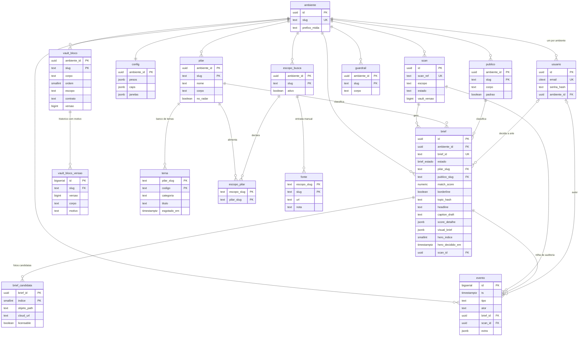

# Diagrama ER — esquema do banco

> Acompanha [`design-esquema-banco.md`](./design-esquema-banco.md), onde estão o
> DDL completo, as políticas de RLS e as decisões por trás de cada tabela.
>
> **Status: desenho, nada implementado.**

## Como ler

Três agrupamentos: o **eixo operacional** (brief, scan, evento, candidatas — o
que muda toda semana), o **vault** (blocos, pilares, públicos, temas, guardrails
— o que molda o conteúdo) e a **configuração** (escopos, fontes, pesos — o que
pesa na hora de pontuar).

`ambiente` é o vértice de tudo: é dele que sai o isolamento por row-level
security e é por ele que a exclusão de um cliente cascateia.

Três leituras que o diagrama torna visíveis:

- **`pilar` é o nó mais referenciado do sistema** — classifica brief, agrupa
  tema e é declarado por escopo de busca. É por isso que o slug dele ser
  imutável não é preciosismo: três caminhos apontam para lá.
- **`evento` recebe de brief, scan e usuário, e não devolve para ninguém.** É
  folha por natureza — append-only, com `ON DELETE SET NULL` para que apagar um
  brief não apague o registro de que ele existiu.
- **`escopo_pilar` é a única ponte entre o vault e a configuração.** À esquerda
  dela, entrada manual (fontes); à direita, vocabulário do vault (pilares).
